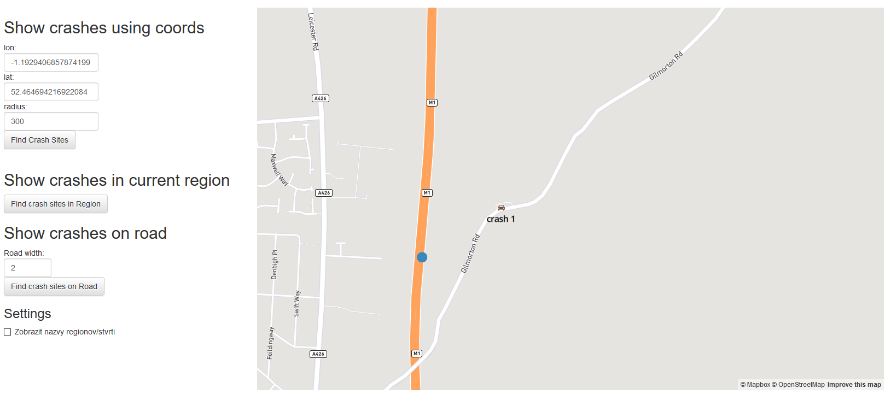

## Overview

This apllication's functionality is showing car accidents in Great Britain on map. This can be done in 3 ways:
-   Car accidents in a radius from a point on map
-   Car accidents within an administrative region
-   Car accidents on specified road
More details on how it works will be explained in chapter Backend.

## Frontend
Source codes to application's frontend can be found [here](/src/main/resources/webapp).
It is pretty simple and straightforward, made using Html, JavaScript, Bootstrap, jQuery and Mapbox.

On the left side of the page are fields and buttons, from which data are used in backend. On the right side is Map (MapBox), on which are displayed results from backend.
Each button click creates an ajax call to Backend REST api, with query parameters required to retrieve data needed for chosen scenario.
Input fields "lon" and "lat", are used in all 3 scenarios. They do not have to be set manually, but can be set by moving with the "draggable point" in map - represented by blue dot.
Field "Radius" is used in 1st scenario, it defines in what radius (in meters) from the point specified by longitude and latitude (first 2 fields) we want to show car accidents after clicking on button "Find Crash Sites".

After clicking "Find crash sites in Region", backend shows all crashes in administrative region, that has draggable point set inside it. Region borders are shown on the map with thick black lines.

Input field "Road width" is used to set the width (in meters) of the road - or distance in which want to show car accidents from the "road" - since road is represented as a line, it does not have width by default.

Checkbox is used to show or hide the names of administrative regions.

The map has at any time at most 4 layers:
1. Region borders
2. Region names
3. Crash sites
4. Road highlight

Crash sites are also clickable, which opens pop-up description containing the date, casualties and number of involved cars.

## Backend
Backend was made in Java, with use of Spark as listening server.
[ApiListener](src/main/java/ApiListener.java) contains "exposed" api, through which frontend communicate with backend.
[ApiResponses](src/main/java/ApiResponses.java) has methods which are called by ApiListener, and do simple argument checking and calls DBManager to contact Database and then generate resposne for frontend.
[DBManager](src/main/java/DBManager.java) handles all connections and selects from database, and then calls appropriate class to generate response using the received data from database.
[Regions](src/main/java/Regions.java) and [CrashSites](src/main/java/CrashSites.java) are classes, that generate complete GeoJson containing data from database, which is ready to be shown in MapBox.

- 1st scenario - show crash sites in radius: is made with a simple select of crash sites from table with car accidents, which ST_DISTANCE is less than specified radius.
- 2nd scenario - show crash sites in region: is made with single select using ST_WITHIN on point we acquired from frontend (draggable point) and administrative regions, and another ST_WITHIN on crash sites and administrative regions we got from the first part.
- 3rd scenario - show crash sites on road: is made with 2 selects. In the first we find the road (and make it polygon using ST_BUFFER and road width we set) on which we set our draggable point. Since roads are represented with multi line strings, we had to use ST_BUFFER on our draggable point, and check which road crosses (ST_CROSSES) our point. Another query finds all crashes, that are within our road's ST_BUFFER. And we send back GeoJson containing both - the road buffer and crash sites.

## Database
Application uses PostgreSQL database with PostGIS extension.
Schema contains 3 tables: accidents_2015 (crash sites), gbr_adm2 (administrative boundaries) and gis.osm_roads_free_1 (roads).

Data were inserted into database using ogr2gui, gbr_adm2 and gis.osm_roads_free_1 were in shape file format (.shp) and accidents_2015 was in .csv.
After importing data, we had to alter the accidents_2015 table, to create geometry object combining the longitude and latitude columns using ST_MAKEPOINT().

